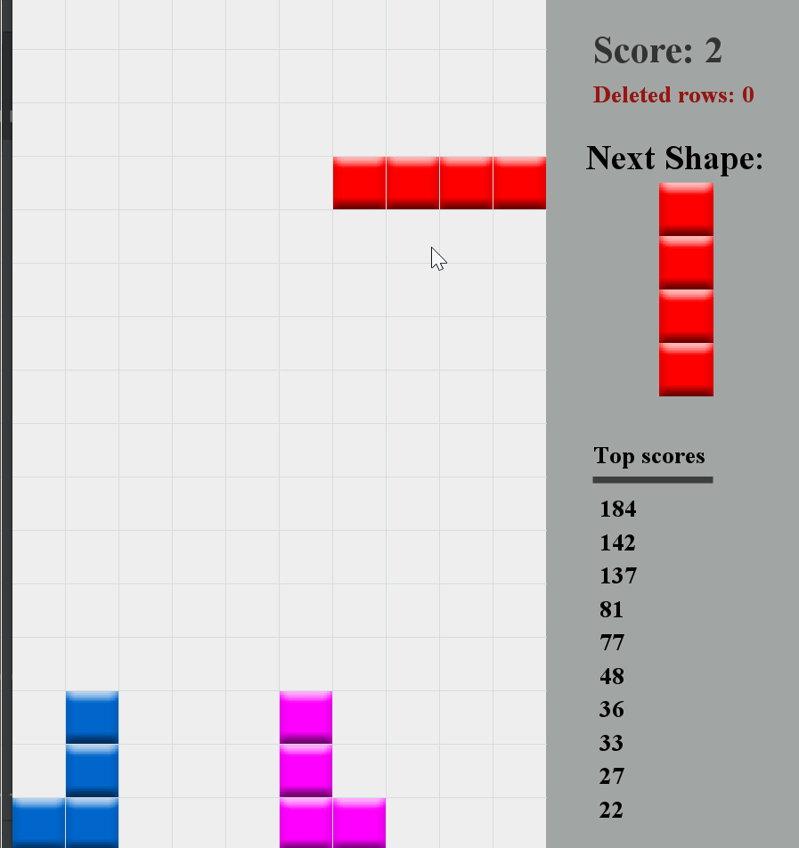
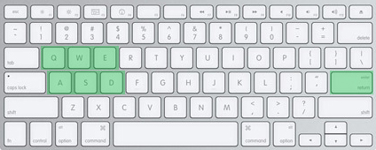

# TETRIS
A Simple TETRIS game with one external command which is named TOOBEH. I'm not a native English speaker be ready for some possible language flaws :)



## Resourse and librarys 
- **Java Version: 13.0.1** 


- **library and modules**
    - jackson-annotations-2.10.3
    - jackson-core-2.10.3
    - jackson-databind-2.10.3
- **Resources**
    - [Jackon guide](http://tutorials.jenkov.com/java-json/jackson-objectmapper.html)
    - [Write a markdown file](https://github.com/adam-p/markdown-here/wiki/Markdown-Cheatsheet)
    - [Work with git](https://faradars.org/courses/fvgit9609-managed-distributed-edition-using-git)
    - [Make 2D games with java](https://www.youtube.com/watch?v=dEKs-3GhVKQ&list=PLah6faXAgguMnTBs3JnEJY0shAc18XYQZ&index=1)
    - [Play sound in java](https://stackoverflow.com/questions/26305/how-can-i-play-sound-in-java)

    
## How to play


- Q : Rotate left
- W : Undo the current move (TOOBEH)
- E : Rotate right
- A : Move left
- S : Speed up!
- D : Move right
- ENTER : start a new game (if you press ENTER before your lost, your score won't be saved! but you can start a new game when ever you want!)

    
## How it works? 
``` 
public static void main(String[] args) {
        Game game = new Game();
        game.start();
    }
```
All the game loop and stuff runs on a new thread I don't know how to use thread professionally but I just want to try it this way! 

Main class is ``Game.java`` which also implements Runnable and KeyListener interfaces dou to run and listen to the players commands. I did my best to write that code functional and neat.

``logic`` package and ``gfx`` package are separated and ``Game.java`` class draw stuffs on the display based on logic part by connecting this two parts to each other.

For saving top scores of all times I have used json. it's pretty simple. also for better performance I have created ``Assets.java`` class dou to load each graphical files just one time over the game. 

I need to point out that the center of the era of all shapes is not same so if you can't rotate a shape in some places don't panic :) just think of a diffrent center of the era. 